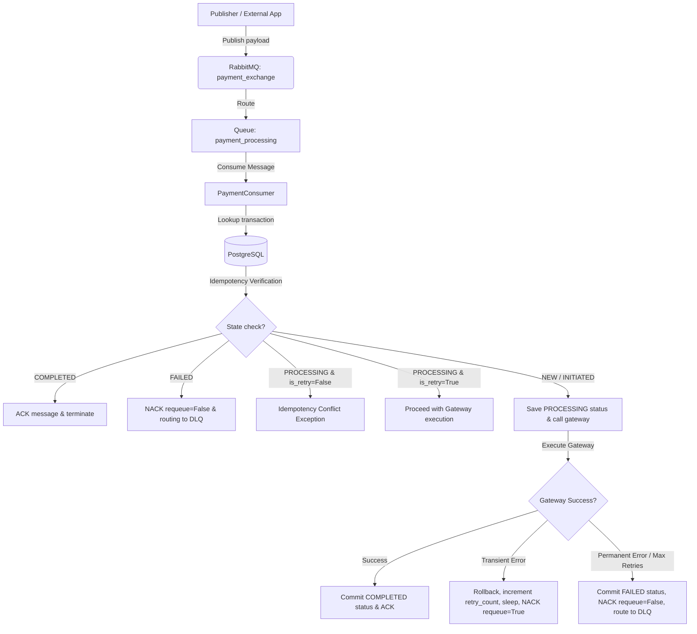

# Event-Driven Payment Processing Service

A complete, production-quality, event-driven payment processing system built using **Python 3.12**, **FastAPI**, **PostgreSQL**, **Alembic**, and **RabbitMQ** (`aio-pika`).

This project implements event-driven consumer architecture, strict idempotency controls, and auto-retry mechanics with exponential backoff and dead-letter queue (DLQ) routing for processing transaction payloads.

## Tech Stack
* **Language:** Python 3.12
* **Framework:** FastAPI (ASGI app server)
* **Database:** PostgreSQL (with SQLAlchemy 2.0 async driver)
* **Message Broker:** RabbitMQ
* **Message Client:** aio-pika (async AMQP client)
* **Migrations:** Alembic
* **Testing:** pytest, pytest-asyncio, testcontainers (isolated PostgreSQL/RabbitMQ testing)
* **Metrics & Logging:** prometheus_client, structlog (structured JSON logging)
* **Validation:** Pydantic v2
* **Containerization:** Docker & Docker Compose

---

## Architectural Workflow


---

## Folder Structure
```
payment-processor/
├── alembic/                # Database migrations schema configurations
├── src/
│   ├── api/
│   │   ├── health.py       # Health check checking Postgres & RabbitMQ
│   │   └── metrics.py      # Prometheus endpoint /metrics
│   ├── consumer/
│   │   ├── consumer.py     # Background aio-pika message consumer
│   │   ├── publisher.py    # Payload publish helper script
│   │   └── rabbitmq.py     # RabbitMQ connection setup & topology
│   ├── models/
│   │   └── payment.py      # SQLAlchemy declarative schema models
│   ├── repositories/
│   │   └── payment_repository.py  # Repository querying/updating transactions
│   ├── schemas/
│   │   └── payment.py      # Pydantic payloads and validation schemas
│   ├── services/
│   │   ├── payment_service.py     # Core payment processing and gateway calls
│   │   └── retry_service.py       # Retry calculations & backoff logic
│   ├── config.py           # Configuration management using Pydantic Settings
│   ├── database.py         # SQLAlchemy engine session dynamic proxies
│   ├── dependencies.py     # FastAPI repository dependencies
│   ├── exceptions.py       # Core custom exceptions hierarchy
│   ├── logging.py          # Structlog JSON structured logging configurations
│   ├── main.py             # FastAPI entrypoint, lifespan startup/shutdown
│   └── metrics.py          # Prometheus counters setup
├── tests/
│   ├── integration/        # Integration tests using Testcontainers
│   └── unit/               # Unit tests checking services, consumers, and DB
├── Dockerfile              # Multi-stage production container
├── docker-compose.yml      # Container orchestration configs
├── .env.example            # Environment configurations reference
├── README.md               # Project documentation
└── requirements.txt        # Package lists
```

---

## How It Works

### Idempotency
* Implemented via a unique constraint on the `idempotency_key` field in the `payment_transactions` database table.
* When a payment request is received:
  1. We lookup the `idempotency_key` in PostgreSQL.
  2. If the transaction has `COMPLETED` status, we return it immediately (idempotent success).
  3. If it is `PROCESSING` and `is_retry` is `False`, we raise a `PaymentIdempotencyConflictException` (concurrency protection).
  4. If `is_retry` is `True` or it is in another status, we proceed.
  5. In case of concurrent request race conditions, a database-level `IntegrityError` is thrown, caught, and rolled back safely to re-query the already-inserted record.

### Retries & Exponential Backoff
* The service classifies errors as **Transient** (e.g. timeout, rate limits, temporary network failure) or **Permanent** (e.g. validation error, declined card, invalid merchant setup).
* On transient failures, the consumer updates the database retry count, calculates backoff delay using the formula `factor * (2 ** retry_count)`, asynchronously sleeps for that delay (`asyncio.sleep()`), and sends a negative acknowledgement (`nack(requeue=True)`) to retry the message.
* Backoff seconds progressive steps: 1s, 2s, 4s, 8s... up to configurable `MAX_RETRIES`.

### Dead-Letter Queue (DLQ)
* If the consumer encounters a **Permanent** failure, or if `retry_count` exceeds `MAX_RETRIES` for a transient error:
  1. The transaction is marked as `FAILED` in PostgreSQL.
  2. The message is negatively acknowledged without requeueing (`nack(requeue=False)`).
  3. RabbitMQ's DLX configuration automatically routes the dead message to `payment_dlq` for human audit.

### Health Endpoint
* Accessible via `GET /health`.
* Dynamically creates a temporary connection to both Postgres (executing `SELECT 1`) and RabbitMQ.
* Returns `200 OK` (with status JSON) if both connections succeed, otherwise returns `503 Service Unavailable`.

### Metrics
* Exposes standard Prometheus metrics via `GET /metrics`:
  - `payment_processor_messages_consumed_total`: Messages consumed.
  - `payment_processor_payments_successful_total`: Successfully completed payments.
  - `payment_processor_payments_failed_total`: Failed payments.
  - `payment_processor_retries_total`: Count of retry operations.

---

## Environment Variables
The application reads settings using Pydantic Settings. The following process environment values are supported:

| Variable Name | Default Value | Description |
|---|---|---|
| `POSTGRES_USER` | `postgres` | Username for database connection. |
| `POSTGRES_PASSWORD` | `postgres` | Password for database connection. |
| `POSTGRES_DB` | `payment_db` | Database schema name. |
| `POSTGRES_HOST` | `localhost` | Database network host address. |
| `POSTGRES_PORT` | `5432` | Database port. |
| `DATABASE_URL` | *Generated* | Full PostgreSQL async connection string. |
| `RABBITMQ_USER` | `guest` | RabbitMQ broker username. |
| `RABBITMQ_PASSWORD` | `guest` | RabbitMQ broker password. |
| `RABBITMQ_HOST` | `localhost` | RabbitMQ broker network host address. |
| `RABBITMQ_PORT` | `5672` | RabbitMQ port. |
| `RABBITMQ_URL` | *Generated* | Full AMQP broker connection string. |
| `MAX_RETRIES` | `4` | Maximum backoff retry attempts. |
| `LOG_LEVEL` | `INFO` | Structlog filtering level (DEBUG, INFO, etc.). |
| `APP_PORT` | `8000` | FastAPI server listening port. |

---

## Setup & Running Instructions

### 1. Build and Start Infrastructure
Run the complete stack including databases, brokers, and application server inside background containers:
```bash
docker-compose up --build -d
```
Verify logs using:
```bash
docker-compose logs -f
```

### 2. Publish a Test Message
To inject a dummy payment transaction payload into the broker:
```bash
# Activate virtualenv and run the publisher script:
source .venv/bin/activate
python -m src.consumer.publisher
```
To simulate transient retry or permanent DLQ paths, specify standard payload parameters:
```python
# Publisher can be called programmatically to inject simulated metadata:
await publish_payment_initiation(
    idempotency_key="key-123",
    amount=10.00,
    currency="USD",
    user_id="user-1",
    simulate_transient=True  # Triggers transient backoff loop
)
```

### 3. Running Tests
Run the entire suite of unit and integration tests (isolated PostgreSQL/RabbitMQ Testcontainers):
```bash
pytest --cov=src --cov-report=term-missing tests/
```

---

## Design Decisions
1. **Loop-Local Dynamic DB Proxies:** Standard database engines bind connection pools to a single thread/loop. To solve loop issues in dynamic ASGI test runners, we designed `EngineProxy` and `AsyncSessionMakerProxy` inside `database.py` to transparently route queries to the correct loop context.
2. **Early State Commit:** We write the `PROCESSING` status to the database *prior* to executing the gateway call, ensuring that the transaction status is saved in case of network timeouts or restarts.
3. **Structured Logging context binding:** Structured logging uses JSON to guarantee readability in aggregation systems (e.g. Datadog, Splunk). Context parameters (such as `idempotency_key`) are bound on logger objects to keep traces clear.
